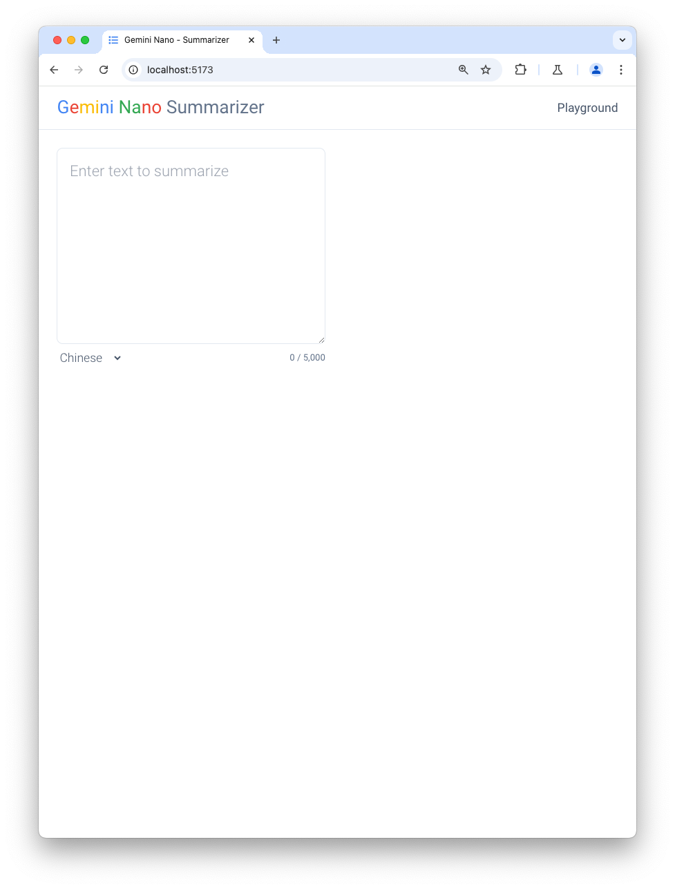
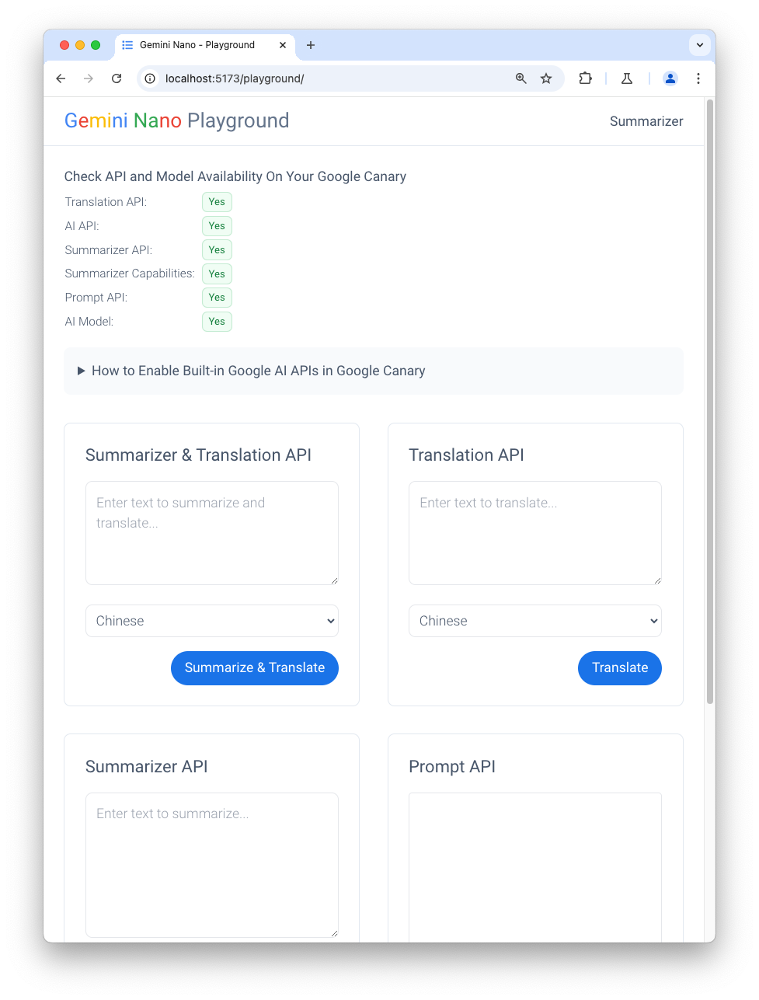

# Gemini Nano Summarizer & Playground

The application provides a versatile interface for summarizing English content and translating it into local languages like Chinese, Spanish, and Japanese. It features two pages: the Summarize page and the Playground page, offering various interaction methods.

## Overview

The application provides textarea and chat interface using Summarization API, Translation API, and Prompt API, leveraging Chrome's built-in Gemini Nano model.

## Running this application

1. Clone this repository.
2. Go to project directory.
3. Run `npm install`.
4. Run `npm run dev`.
5. Visit [http://localhost:5173/](http://localhost:5173/) using Google Canary web browser.

## How to Enable Experimental features in Google Canary

1. Type `chrome://flags` in the address bar
1. Enabled without language pack limit "Experimental translation API"
1. Enable "Prompt API for Gemini Nano"
1. Enable "Summarization API for Gemini Nano"
1. Enable "Writer API for Gemini Nano"
1. Enable "Rewriter API for Gemini Nano"
1. Enabled BypassPerfRequirement "Enables optimization guide on device" (It will download the Gemini Nano model in the background)
1. Restart the browser
1. Type `chrome://components` in the address bar and update "Optimization Guide On Device Model"